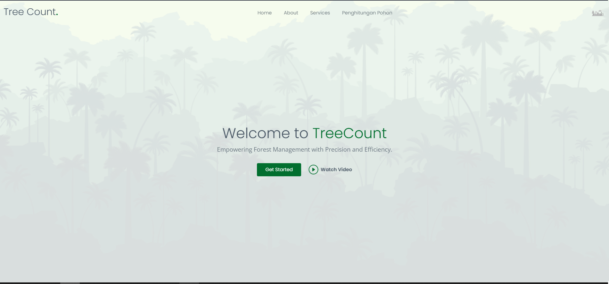
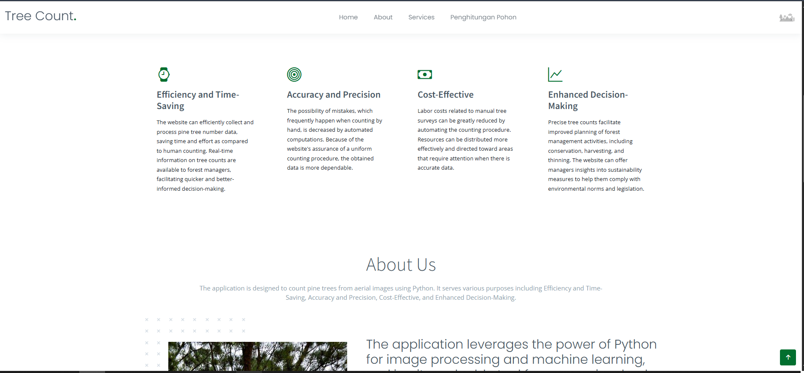
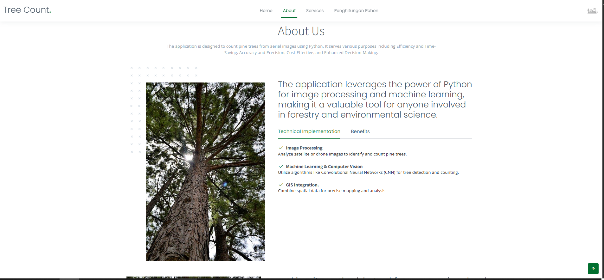
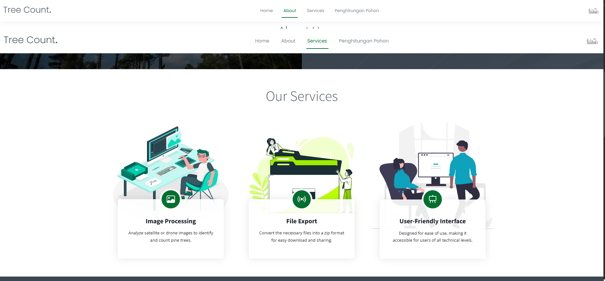
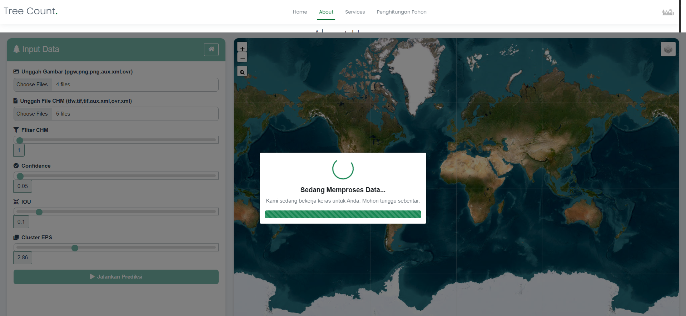
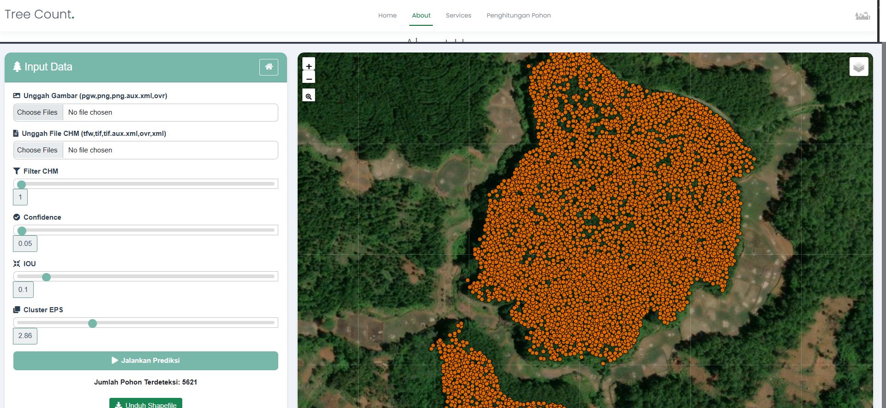
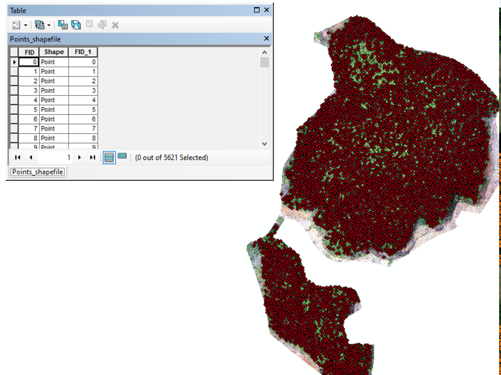

# 🌳 Tree Counting Web App with YOLOv8 + Flask + GIS

A lightweight and interactive web application to detect and count trees from aerial imagery using **YOLOv8**, built with **Flask**. This project supports spatial export to SHP/GeoJSON, map-based visualization, and real-time object detection. Ideal for forestry, remote sensing, and geospatial analysis 🌲🛰️

---

## 📸 Screenshots

| Landing Page | Upload Image | Detection Result | Dashboard |
|--------------|--------------|------------------|-----------|
|  |  |  |  |

| OSM Map | Geo Output | SHP View |
|---------|------------|----------|
|  |  |  |

---

## 🚀 Features

✅ YOLOv8-based tree counting  
✅ Flask-powered web interface  
✅ Upload aerial imagery and process instantly  
✅ Export centroid results as SHP or GeoJSON  
✅ Interactive Leaflet map with OSM  
✅ NDVI / CHM filters (optional & extensible)

---

## 🧰 Tech Stack

| Layer        | Tools Used                           |
|--------------|--------------------------------------|
| Backend      | Flask, Python                        |
| Deep Learning| YOLOv8 (Ultralytics)                 |
| Geospatial   | Fiona, Shapely, Rasterio, PyProj     |
| Frontend     | HTML5, CSS, JS, Leaflet.js           |
| Others       | OpenCV, NumPy, Matplotlib            |

---

## 📂 Folder Structure

```bash
.
├── static/
│   └── images/             # Screenshots & user-uploaded images
├── templates/              # HTML templates (Flask Jinja2)
├── weights/                # YOLOv8 model weights
├── js/                     # JavaScript for frontend interactivity
├── treecounting.py         # Main Flask app
├── model_processing.py     # Image detection & shapefile creation
├── requirements.txt        # Python dependencies
├── INSTALASI.txt           # Install guide (alt version)
├── SlidingWindowOK.ipynb   # YOLO tiling test (optional)
└── README.md               # This file 😎

# 1. Clone this repository
git clone https://github.com/username/tree-counting-webflask.git
cd tree-counting-webflask

# 2. Create virtual environment
python -m venv venv
source venv/bin/activate   # Windows: venv\Scripts\activate

# 3. Install dependencies
pip install -r requirements.txt

# 4. Run Flask app
python treecounting.py


📤 Output Format
🗂️ pointtree.shp – hasil deteksi koordinat pohon

🌍 GeoJSON untuk mapping ke webGIS

📷 Visual hasil deteksi disimpan di folder static/outputs (jika ada)

🎯 Centroid pohon = titik koordinat bounding box terdeteksi


